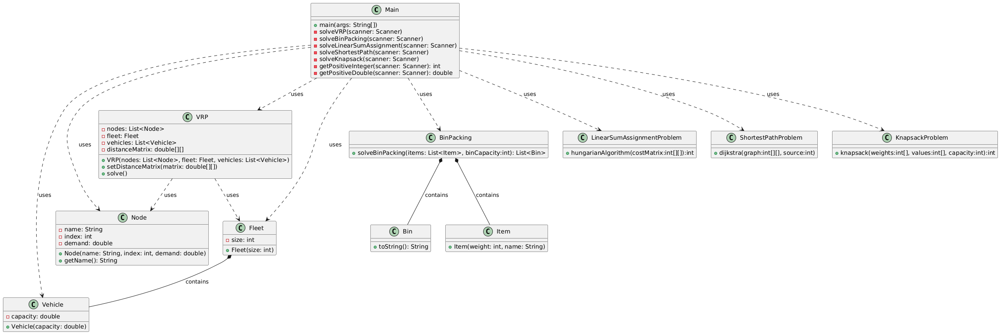

# BlueSquares

## Οδηγίες μεταγλώττισης

Για να μεταγλωττίσετε το πρόγραμμα, χρησιμοποιήστε Maven:
```bash
mvn clean install
```

Αυτό θα δημιουργήσει το αρχείο JAR στο φάκελο `target`.

---

## Οδηγίες εκτέλεσης

Για να εκτελέσετε το πρόγραμμα, χρησιμοποιήστε την ακόλουθη εντολή από τον φάκελο του έργου:
```bash
java -jar target/VRPProject-1.0-SNAPSHOT.jar
```

---

## Οδηγίες χρήσης

1. Εκτελέστε την εφαρμογή χρησιμοποιώντας την παραπάνω εντολή.
2. Επιλέξτε τις επιθυμητές παραμέτρους από το περιβάλλον χρήστη ή μέσω γραμμής εντολών.
3. Ακολουθήστε τις οδηγίες στην οθόνη για να ολοκληρώσετε την εργασία σας.

---

## Δομή περιεχομένων του αποθετηρίου

- `/srcc/main/java` : Περιέχει τον κύριο κώδικα της εφαρμογής.
- `/test` : Κώδικας για τις μονάδες δοκιμών.
- `pom.xml` : Αρχείο διαμόρφωσης Maven.
  
---

## Διάγραμμα UML



Το διάγραμμα περιγράφει τη βασική δομή της εφαρμογής:
- Οι βασικές κλάσεις είναι οι εξής:
  - `Main`: Σημείο εκκίνησης της εφαρμογής.
  - `VRP`: Υπεύθυνη για την εύρεση βέλτιστων διαδρομών.
  - `BinPacking`: Υπεύθυνη για την επίλυση του προβλήματος BinPacking.
  - `KnapsackProblem`: Υπεύθυνη για την επίλυση του προβλήματος Knapsack.
  - `LinearSumProblem`: Υπεύθυνη για την επίλυση του προβλήματος LinearSum.

---

## Επισκόπηση δομών δεδομένων και αλγορίθμων

### Δομές δεδομένων

- **Γράφοι (Graphs)**: Χρησιμοποιούνται για την αναπαράσταση των διαδρομών.
- **Πίνακες γειτνίασης (Adjacency Matrices)**: Απεικονίζουν συνδέσεις μεταξύ κόμβων.
- **Λίστες (Lists)**: Αποθηκεύουν λύσεις, κόμβους και διαδρομές.

### Αλγόριθμοι

1. **Dijkstra's Algorithm**:
   - Χρησιμοποιείται για την εύρεση της συντομότερης διαδρομής.
2. **Genetic Algorithm**:
   - Εφαρμόζεται για τη βελτιστοποίηση διαδρομών.
3. **Local Search Heuristic**:
   - Παρέχει περαιτέρω βελτίωση των λύσεων.
